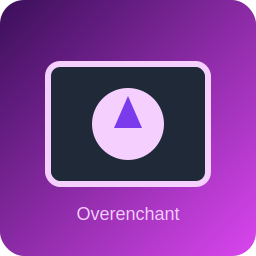
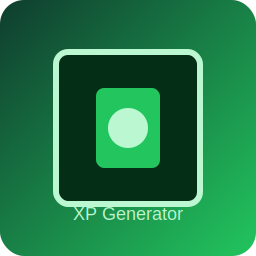
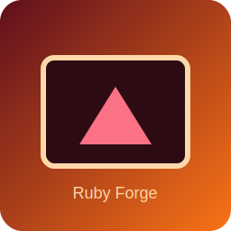
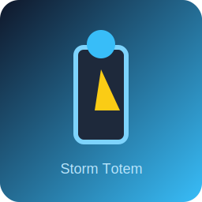
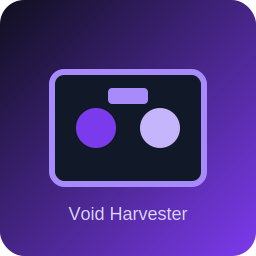

# InsaneCraft Mod Design Notes

## 🔷 Core Systems

### Ore Upgrader Block
**Example:** Diamond Block Wall → Diamond Block (left-click)

**How it works**
- New block: **Ore Upgrader**.
- When you left-click it with a valid block:
  - Consumes the input.
  - Gives upgraded output.

**Example Recipes**
| Input | Output |
| --- | --- |
| Diamond Block Wall | Diamond Block |
| Iron Geode | Iron Blocks |
| Crying Obsidian + Diamond Blocks | Overenchantment Table |

**MCreator Setup**
1. Create **Block**.
2. Enable **When block clicked** procedure.

**Procedure logic**
- Check item in player hand.
- If matches → remove item → give upgraded item.

**Optional**
- Particles
- Sound
- Cooldown

---

### Overenchantment Table
**Goal:** Go beyond vanilla enchant limits with very expensive crafting.

**Features**
- Fortune 15, Sharpness 10+ (custom max levels).
- Can apply exclusive enchants.
- Very expensive to craft.

**Crafting**
- Crying Obsidian
- Diamond Blocks
- Nether Star

**Enchant Ideas**
- Fortune XV
- Looting X
- Vein Miner
- Lifesteal
- Auto-Smelt

---

### XP Enhancer
**Goal:** Custom enchantment UI that consumes XP + rare materials.

**Requirements**
- Custom Enchantment (remove max level limit).
- Custom GUI.
- Materials + XP gates.

**Procedure**
- Apply enchant on button click.

---

### XP Generator System
**Upgradeable XP farms with tiers.**

**Level Output**
| Level | XP Output |
| --- | --- |
| 1 | Low |
| 3 | Medium |
| 5 | Insane |

**Upgrade Method**
- Use XP Bottles.
- Right-click generator to upgrade.
- Create Block with Block Entity.

**Store (NBT)**
- XP amount.
- Level.

**Procedure**
- On right-click with XP bottle → increase tier.

**Optional**
- Visual change per tier.
- Particle intensity increases.

---

## 🟣 New Ores & Materials

### Rubies
- Rarer than diamonds.
- Multiple tiers with gear scaling.

**Rarity Bonuses**
| Rarity | Bonus |
| --- | --- |
| Common | Diamond-level |
| Rare | +Speed |
| Epic | +Strength |
| Legendary | Special ability |

**Implementation**
- New Ore.
- New Armor + Tool sets.
- Attribute modifiers per tier.

### Moonstone
- Spawns (define biome/height rules in generator).

---

## ✨ Unique Systems

### Ruby Forge
A custom forge that upgrades ruby gear tiers using rare materials, producing stronger gear stats.

### Moonstone Ritual
A ritual pedestal that consumes moonstone + rare materials to grant a **Moonstone Blessing** token.

### Celestial Altar
Consumes rare offerings plus **starlight** to craft celestial items like **Celestial Cores** or **Astral Focus** artifacts.

### Storm Totem
Charge a totem with storm materials to summon escalating weather events (Breeze → Tempest → Cataclysm).

### Void Harvester
A fuel-powered block entity that generates **Void Fragments**, with upgrades to improve cycle speed and output.

---

## 🎨 Concept Art

> These are lightweight SVG mockups to visualize the systems.

- Ore Upgrader: 
- Overenchantment Table: 
- XP Generator: 
- Ruby Forge: 
- Moonstone Ritual: 
- Celestial Altar: 
- Storm Totem: 
- Void Harvester: 

---

## Target Platforms
- Minecraft Bedrock & Java Mod

## Export (Demo Jar)
Run the helper script to compile and package the demo mod entry point:

```bash
bash export_mod.sh
```

This creates `dist/insanecraft-demo.jar` with `com.insanecraft.InsaneCraftMod` as the main class.

## Fabric Setup (Minecraft)
This repo now includes a minimal Fabric setup so the mod loads inside Minecraft:

1. Install Java 17.
2. Run the dev client (ensure Java 17 is used):
   ```bash
   JAVA_HOME=/path/to/java17 gradle runClient
   ```
3. The mod entrypoint is `com.insanecraft.fabric.InsaneCraftFabricMod` and initializes the core systems.

> Note: Block/item registration and assets still need to be wired into Fabric registries for in-game content.
